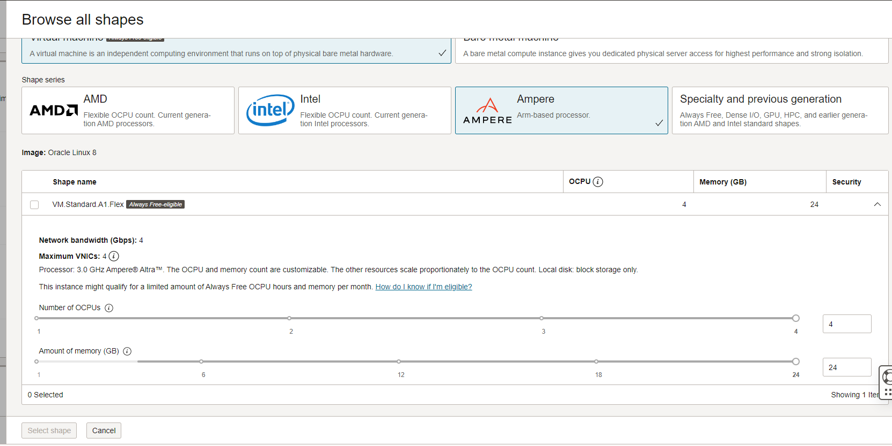
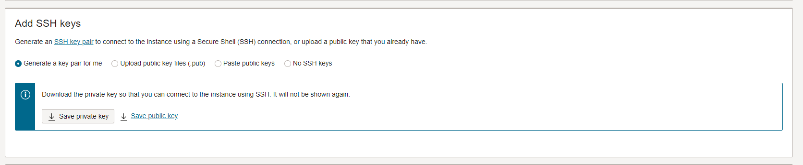
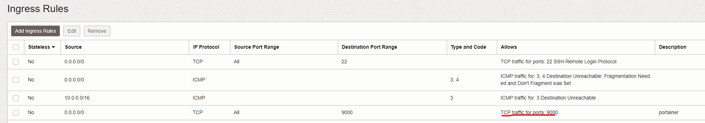
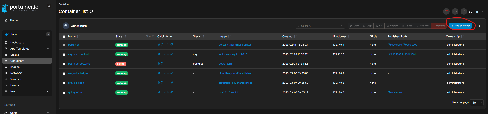
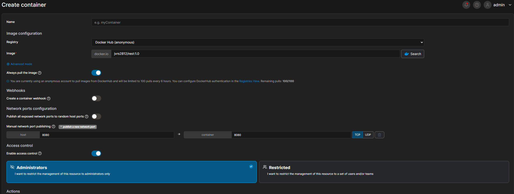

#  Projeto de Exemplo de Deploy

Este é um projeto de exemplo que demonstra como fazer o deploy de uma aplicação web simples usando o [Docker](https://www.docker.com/) e o [Portainer](https://www.portainer.io/). A API consiste em um servidor [Java](https://www.java.com/pt-BR/) que serve um JSON mockado na memoria.

## Pré-requisitos

Antes de iniciar o deploy, certifique-se de ter as seguintes ferramentas instaladas em sua máquina:

-   Docker
-   Java 19
- Maven

## Instruções de Deploy

1.  Clone este repositório em sua máquina local:
	`https://github.com/jvrs2812/api-rest-faculdade.git`

2.  Navegue até o diretório do projeto:
	`cd api-rest-faculdade`

3.  Construa a imagem Docker da aplicação:
        `mvn clean install`
	`docker build -t rest:1.0`

4.  Faça o login no Docker Hub:
	`docker login`

5.  Faça o push da imagem Docker para o Docker Hub:
	`docker push seu-usuario/rest:1.0`

6.  Iremos criar uma VPS na oracle para ARM:

    
7.  Iremos baixar as chaves publicas e privadas.

8. Após subir a máquina virtual iremos se conectar via ssh.
	`ssh -i "caminho da sua key" username@ip`

9. Após feita a conexão iremos instalar o docker
  [Docker](https://docs.docker.com/engine/install/centos/)

10. Após isso iremos subir o portainer para poder gerenciar os container.
	[Portainer](https://docs.portainer.io/start/install/server/docker/linux)

11. Após isso iremos abrir a porta 9000 da vps.

12. Basta acessar o portainer.
   `http://seu-ip:9000`

13. Após criar seu login iremos configurar o container Docker.
   

   Dentro do container iremos procurar pelo nosso repositorio no docker hub.
   
   

   e basta fazer o deploy, lembrando sempre de exportar as portas que sua apliação usa, no nosso caso a 8080

## OBS
Se notarem o docker file faz referencia ao java para arm, como a vps e com processadores arm, vocês não conseguiram subir aplicações que não tem suporte para processadores arms

## Avançado
Utilizei o cloudflare com os tunnels para não ter que ficar abrindo portas da vps para o mundo e ao mesmo tempo proteger o ip da minha máquina real, mas como esse topico é avançado e mais complicado fico a disposição a responde qualquer duvida sobre.

URL padrao do projeto: https://api.alunosunip.com/v1/users
